<div align="center">

# 🚀 AWS EverShop Cloud Deployment Platform

### Enterprise-Grade Cloud Deployment of EverShop using AWS DevOps Services

Deploying a production-ready e-commerce platform on AWS with Docker, Amazon ECS, Amazon ECR, Amazon RDS, CloudFront, Route 53, CI/CD, Auto Scaling, and Secure Cloud Storage.

---


</div>

---

# 📖 Project Overview

This project demonstrates the deployment of the **EverShop E-commerce Application** on Amazon Web Services (AWS) using modern **Cloud Computing** and **DevOps** practices.

The objective was to transform a locally running application into a secure, scalable, highly available, and production-ready cloud architecture.

The project incorporates Infrastructure, Compute, Networking, Security, Storage, Containerization, Continuous Integration & Continuous Deployment (CI/CD), and Content Delivery services offered by AWS.

The complete solution was implemented as part of an AWS Cloud & DevOps Internship.

---

# 🌐 Live Application

**Website**

```
https://evershop.riyaa.xyz/
```

---

# 📌 Project Objectives

- Deploy a production-ready e-commerce application on AWS
- Secure custom domain with HTTPS
- Configure scalable infrastructure
- Containerize the application using Docker
- Automate deployments with CI/CD
- Deliver static assets globally using CloudFront
- Secure product images using Amazon S3
- Optimize storage costs using Lifecycle Policies
- Build a highly available cloud architecture

---

# ✨ Key Features

### ☁️ Cloud Infrastructure

- Amazon ECS (EC2 Launch Type)
- Amazon EC2
- Amazon RDS PostgreSQL
- Amazon ECR
- Docker Containerization

---

### 🌍 Networking

- Amazon Route 53
- Application Load Balancer
- Amazon CloudFront
- HTTPS with SSL Certificates
- Custom Domain Configuration

---

### 🔒 Security

- AWS Certificate Manager (ACM)
- Origin Access Control (OAC)
- Block Public Access
- Bucket Owner Enforced
- Server Side Encryption
- IAM Roles & Policies

---

### 🚀 DevOps

- Docker
- Amazon ECR
- AWS CodePipeline
- AWS CodeBuild
- Blue/Green Deployment
- Immutable Infrastructure

---

### 📦 Storage

- Amazon S3
- Lifecycle Policies
- Intelligent Tiering
- Glacier Transition
- Amazon S3 Inventory

---

### 📈 Scalability

- Amazon ECS Services
- Auto Scaling Group
- Application Load Balancer
- Highly Available Architecture

---

# 🏗️ AWS Architecture

> Replace the image below with your architecture diagram.

<p align="center">


</p>

---

# ⚙️ High-Level Architecture

```text
                     Users
                        │
                        ▼
                 Amazon Route 53
                        │
                        ▼
                  Amazon CloudFront
                        │
                        ▼
          Application Load Balancer (ALB)
                        │
                        ▼
               Amazon ECS (EC2 Launch Type)
                        │
          ┌─────────────┴─────────────┐
          │                           │
          ▼                           ▼
    EverShop Container         EverShop Container
          │                           │
          └─────────────┬─────────────┘
                        │
                        ▼
               Amazon RDS PostgreSQL
                        │
                        ▼
                 Amazon S3 Bucket
                        │
                        ▼
                Product Images
```

---

# 🧩 Project Architecture Explanation

The deployment follows a modern cloud-native architecture.

### 1️⃣ User Request

Users access the application using the custom domain.

```
https://evershop.riyaa.xyz/
```

Route 53 resolves the DNS request and directs users to Amazon CloudFront.

---

### 2️⃣ Amazon CloudFront

CloudFront caches static content such as:

- CSS
- JavaScript
- Product Images
- Fonts

This significantly reduces latency and improves website performance.

---

### 3️⃣ Application Load Balancer

The Application Load Balancer receives incoming traffic and distributes requests across running ECS tasks.

Benefits:

- High Availability
- Health Checks
- Load Distribution
- Fault Tolerance

---

### 4️⃣ Amazon ECS

The application runs as Docker containers inside Amazon ECS.

Responsibilities:

- Container Scheduling
- Service Management
- Task Deployment
- Auto Recovery

---

### 5️⃣ Amazon RDS PostgreSQL

Stores all application data including:

- Products
- Categories
- Orders
- Customers
- User Accounts

---

### 6️⃣ Amazon S3

Stores product images securely.

CloudFront retrieves images from the private bucket using Origin Access Control (OAC).

---

# 🛠️ Technology Stack

| Category | Technologies |
|-----------|--------------|
| Frontend | EverShop |
| Backend | Node.js |
| Database | PostgreSQL (Amazon RDS) |
| Containerization | Docker |
| Container Registry | Amazon ECR |
| Container Orchestration | Amazon ECS |
| Load Balancer | Application Load Balancer |
| DNS | Amazon Route 53 |
| CDN | Amazon CloudFront |
| SSL | AWS Certificate Manager |
| Object Storage | Amazon S3 |
| CI/CD | AWS CodePipeline, AWS CodeBuild |
| Monitoring | Amazon CloudWatch |
| Security | IAM, OAC, ACM |
| Operating System | Amazon Linux 2023 |

---

# 📂 Repository Structure

```text
aws-evershop-cloud-deployment-intership-project/

│
├── app/
│   ├── task-1/
│   ├── task-2/
│   ├── task-3/
│   ├── task-4/
│   ├── task-5/
│   ├── task-6/
│   ├── docker-compose.yml
│   ├── Dockerfile
│   └── source-code/
│
├── docs/
│   ├── architecture/
│   │      └── aws-architecture.png
│   │
│   ├── task-1/
│   ├── task-2/
│   ├── task-3/
│   ├── task-4/
│   ├── task-5/
│   └── task-6/
│
├── README.md
│
└── LICENSE
```

---

# 📸 Project Preview

<p align="center">


</p>

> Replace the image above with the homepage screenshot of your deployed EverShop application.

---

# 📑 Documentation

Each internship task has its own detailed documentation.

| Task | Documentation |
|------|---------------|
| Task 1 | [Route 53, ACM & HTTPS](docs/task-1/README.md) |
| Task 2 | [Amazon RDS PostgreSQL](docs/task-2/README.md) |
| Task 3 | [Auto Scaling & High Availability](docs/task-3/README.md) |
| Task 4 | [Amazon ECS, ECR & CI/CD](docs/task-4/README.md) |
| Task 5 | [CloudFront & Secure Content Delivery](docs/task-5/README.md) |
| Task 6 | [Advanced Amazon S3 Storage](docs/task-6/README.md) |

---

➡️ Continue to **Part 2** for:
- Installation Guide
- Deployment Process
- CI/CD Workflow
- Task 1 Documentation
- Task 2 Documentation

# 🚀 Deployment Workflow

The deployment process follows an automated DevOps pipeline to ensure reliable and repeatable releases.

```text
Developer
    │
    ▼
GitHub Repository
    │
    ▼
AWS CodePipeline
    │
    ▼
AWS CodeBuild
    │
    ▼
Docker Image Build
    │
    ▼
Amazon Elastic Container Registry (ECR)
    │
    ▼
Amazon ECS Service
    │
    ▼
Application Load Balancer
    │
    ▼
Amazon CloudFront
    │
    ▼
Users
```

---

# ⚙️ Application Deployment Process

## Step 1 - Clone the Repository

```bash
https://github.com/Riya-te/aws-evershop-cloud-deployment-intership-project.git
```

---

## Step 2 - Build Docker Image

```bash
docker build -t evershop-app .
```

---

## Step 3 - Push Image to Amazon ECR

Authenticate Docker with Amazon ECR.

```bash
aws ecr get-login-password \
--region ap-south-1 \
| docker login \
--username AWS \
--password-stdin <AWS_ACCOUNT_ID>.dkr.ecr.ap-south-1.amazonaws.com
```

Tag the image.

```bash
docker tag evershop-app:latest \
<AWS_ACCOUNT_ID>.dkr.ecr.ap-south-1.amazonaws.com/evershop:latest
```

Push the image.

```bash
docker push \
<AWS_ACCOUNT_ID>.dkr.ecr.ap-south-1.amazonaws.com/evershop:latest
```

---

## Step 4 - Deploy to Amazon ECS

Amazon ECS pulls the latest Docker image from Amazon ECR and launches new tasks.

Deployment includes:

- New Task Definition
- ECS Service Update
- Container Health Checks
- Blue/Green Deployment
- Zero Downtime Release

---

## Step 5 - Verify Deployment

Open:

```
https://evershop.riyaa.xyz/
```

Verify:

- HTTPS enabled
- Application loads successfully
- Product images load correctly
- Database connectivity
- CloudFront caching

---

# 🔄 CI/CD Pipeline

Continuous Integration and Continuous Deployment are implemented using AWS CodePipeline and AWS CodeBuild.

## Pipeline Flow

```text
GitHub Commit
      │
      ▼
AWS CodePipeline
      │
      ▼
AWS CodeBuild
      │
      ▼
Docker Image
      │
      ▼
Amazon ECR
      │
      ▼
Amazon ECS
      │
      ▼
Blue/Green Deployment
      │
      ▼
Production
```

---

## Pipeline Stages

### Source Stage

- GitHub Repository
- Automatic Source Detection
- Trigger on Code Push

---

### Build Stage

AWS CodeBuild performs:

- Source Download
- Dependency Installation
- Docker Image Build
- Docker Image Validation
- Push to Amazon ECR

---

### Deploy Stage

Amazon ECS automatically:

- Pulls latest image
- Creates new tasks
- Performs health checks
- Routes traffic through the Application Load Balancer
- Removes old tasks after successful deployment

---

# 📦 Docker Containerization

The EverShop application is fully containerized using Docker.

### Benefits

- Consistent deployment
- Easy scalability
- Faster releases
- Environment consistency
- Immutable deployments

---

# 📖 Internship Task 1

## Secure Domain Management

### Objective

Configure a secure custom domain using Amazon Route 53 and AWS Certificate Manager.

### Services Used

- Amazon Route 53
- AWS Certificate Manager
- Application Load Balancer
- Amazon CloudFront

### Implemented Features

- Custom Domain Configuration
- HTTPS
- SSL/TLS Certificates
- Automatic Certificate Validation
- Secure Browser Communication

---

### Workflow

```text
User
    │
    ▼
Route53
    │
    ▼
CloudFront
    │
    ▼
Application Load Balancer
```

---

### Screenshots

Located in

```
docs/task-1/screenshots/
```

Examples:

- Hosted Zone
- DNS Records
- ACM Certificate
- HTTPS Website
- Route53 Configuration

---

📘 Detailed Documentation

```
docs/task-1/README.md
```

---

# 🗄️ Internship Task 2

## Highly Available Database Deployment

### Objective

Deploy Amazon RDS PostgreSQL for the EverShop application.

---

### AWS Services

- Amazon RDS
- PostgreSQL
- Amazon VPC
- Security Groups

---

### Implemented Features

- PostgreSQL Database
- Secure Connectivity
- Automated Backups
- Database Encryption
- High Availability Configuration

---

### Database Stores

- Products
- Categories
- Customers
- Orders
- User Accounts

---

### Architecture

```text
Amazon ECS

     │

     ▼

Amazon RDS PostgreSQL
```

---

### Benefits

- Managed Database
- Automatic Backups
- Secure Access
- Reliable Storage
- Easy Maintenance

---

### Screenshots

Located in

```
docs/task-2/screenshots/
```

Examples:

- RDS Instance
- Connectivity
- Security Groups
- Database Configuration
- EverShop Database

---

📘 Detailed Documentation

```
docs/task-2/README.md
```

---

# 📌 Progress Summary

| Task | Status |
|------|--------|
| Task 1 – Route 53 & HTTPS | ✅ Completed |
| Task 2 – Amazon RDS PostgreSQL | ✅ Completed |
| Task 3 – Auto Scaling | ➡️ Covered in Part 3 |
| Task 4 – ECS & ECR Deployment | ➡️ Covered in Part 3 |
| Task 5 – CloudFront | ➡️ Covered in Part 4 |
| Task 6 – Advanced Amazon S3 | ➡️ Covered in Part 4 |

---

➡️ Continue to **Part 3** for:

- Auto Scaling (Task 3)
- Amazon ECS & Amazon ECR Deployment (Task 4)
- Blue/Green Deployment
- Container Architecture

# 📈 Internship Task 3

# Auto Scaling & High Availability

## Objective

Improve the availability and reliability of the EverShop application by deploying Amazon EC2 instances inside an Auto Scaling Group integrated with an Application Load Balancer.

The Auto Scaling Group continuously monitors instance health and automatically launches replacement instances whenever required.

---

## AWS Services Used

- Amazon EC2
- Amazon Auto Scaling
- Application Load Balancer
- Amazon ECS (EC2 Launch Type)

---

## Architecture

```text
                 Internet Users
                        │
                        ▼
           Application Load Balancer
                        │
         ┌──────────────┴──────────────┐
         │                             │
         ▼                             ▼
    Amazon EC2                   Amazon EC2
         │                             │
         └──────────────┬──────────────┘
                        │
                        ▼
                 Amazon ECS Cluster
```

---

## Features

- Auto Scaling Group
- Launch Template
- Desired Capacity Management
- Health Monitoring
- Automatic Instance Replacement
- Load Balancer Integration
- High Availability

---

## Working

1. Users send requests to the Application Load Balancer.
2. The Load Balancer distributes traffic across healthy EC2 instances.
3. The Auto Scaling Group continuously monitors instance health.
4. If an instance becomes unhealthy, it is automatically terminated.
5. A new EC2 instance is launched using the Launch Template.
6. The new instance joins the ECS cluster and starts serving traffic.

---

<p align="center">
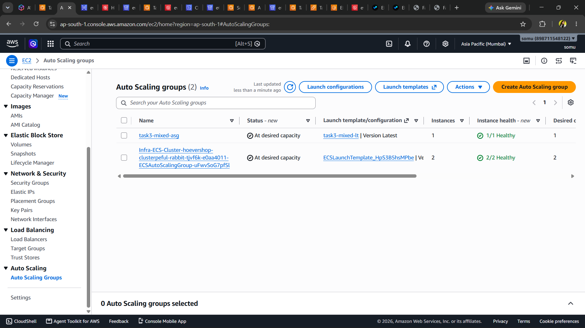
</p>

<p align="center">
<b>Amazon EC2 Auto Scaling Group</b>
</p>

---

<p align="center">
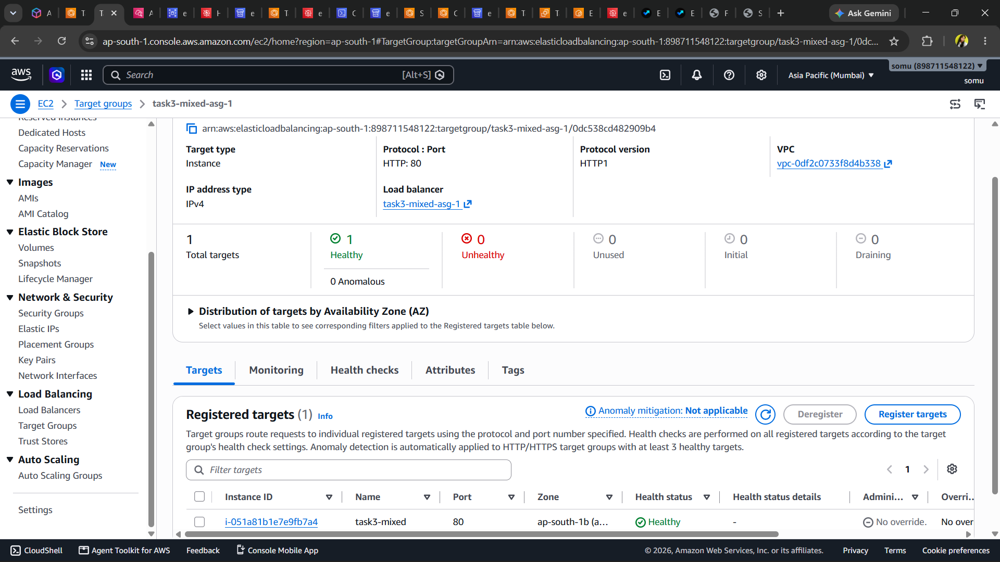
</p>

<p align="center">
<b>Target Group</b>
</p>

---

📘 **Detailed Documentation**

```
docs/task-3/README.md
```

---

# 🚀 Internship Task 4

# Immutable Deployment with Amazon ECS & Amazon ECR

## Objective

Deploy the EverShop application as Docker containers using Amazon ECS and Amazon ECR while implementing an automated CI/CD pipeline using AWS CodePipeline and AWS CodeBuild.

The deployment follows an immutable infrastructure approach where every release creates a new Docker image and deploys a new application version without modifying the running environment.

---

## AWS Services Used

- Docker
- Amazon ECR
- Amazon ECS
- Amazon EC2
- AWS CodePipeline
- AWS CodeBuild
- Application Load Balancer
- AWS Systems Manager Parameter Store

---

## Deployment Architecture

```text
Developer

     │

     ▼

GitHub Repository

     │

     ▼

AWS CodePipeline

     │

     ▼

AWS CodeBuild

     │

     ▼

Docker Image Build

     │

     ▼

Amazon ECR

     │

     ▼

Amazon ECS Service

     │

     ▼

Application Load Balancer

     │

     ▼

Users
```

---

## Container Deployment Workflow

### Step 1

Developer pushes source code to GitHub.

↓

### Step 2

AWS CodePipeline automatically detects the new commit.

↓

### Step 3

AWS CodeBuild downloads the source code and builds a Docker image.

↓

### Step 4

The Docker image is pushed to Amazon ECR.

↓

### Step 5

Amazon ECS pulls the latest image from ECR.

↓

### Step 6

A new ECS deployment starts.

↓

### Step 7

Application Load Balancer routes traffic to healthy containers.

---

## Blue/Green Deployment

The application uses an immutable deployment strategy.

Instead of modifying running containers,

✔️ A completely new container image is created.

✔️ New ECS Tasks are deployed.

✔️ Health checks are performed.

✔️ Traffic is routed to healthy containers.

✔️ Old containers are removed after successful deployment.

This ensures minimal downtime during deployments.

---

## Features

- Docker Containerization
- Amazon ECR
- Amazon ECS
- Immutable Infrastructure
- Automated CI/CD
- Blue/Green Deployment
- Zero Downtime Releases
- Load Balanced Architecture

---

<p align="center">
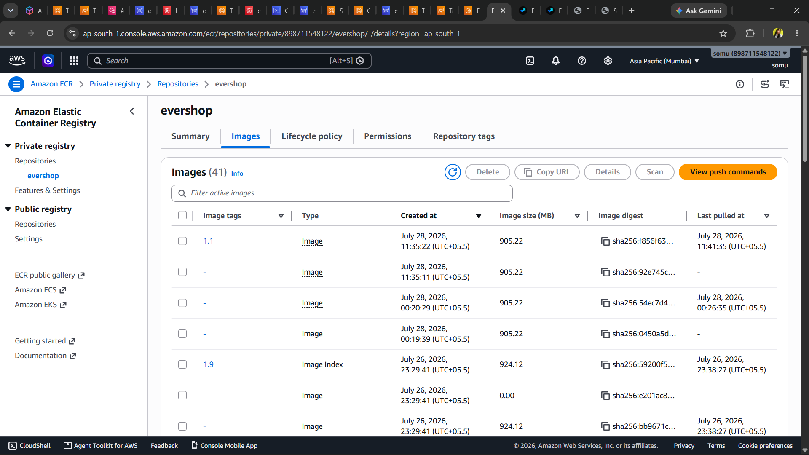
</p>

<p align="center">
<b>Amazon Elastic Container Registry</b>
</p>

---

<p align="center">
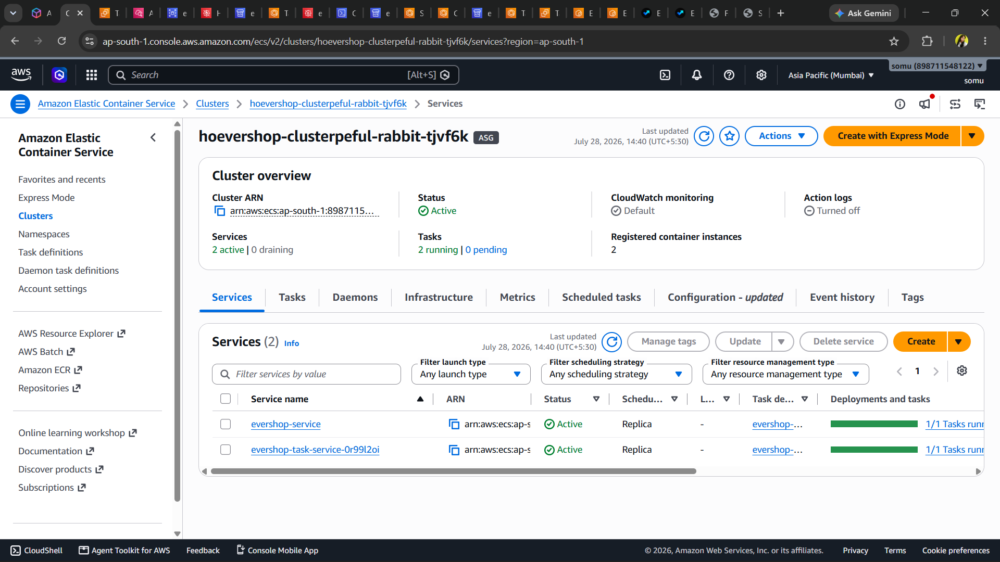
</p>

<p align="center">
<b>Amazon ECS Cluster</b>
</p>

---

<p align="center">
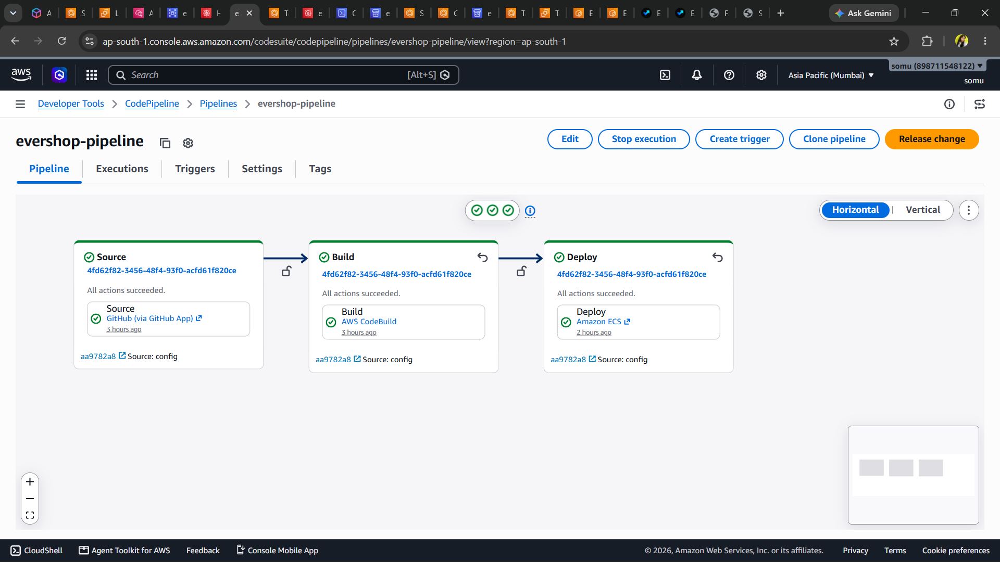
</p>

<p align="center">
<b>AWS CodePipeline</b>
</p>

---

<p align="center">
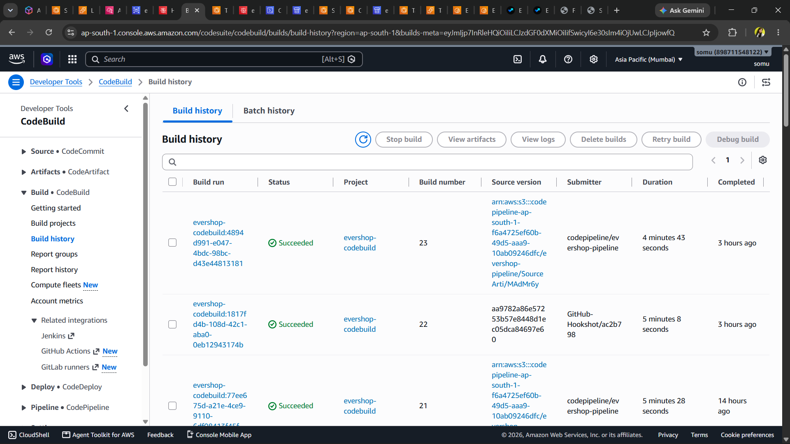
</p>

<p align="center">
<b>AWS CodeBuild</b>
</p>

---

## Container Architecture

```text
Docker Container

│

├── EverShop Application

├── Node.js Runtime

├── Dependencies

├── Static Assets

└── Environment Configuration
```

---

## Benefits

- Immutable Infrastructure
- Consistent Deployments
- Faster Releases
- Automated Build Pipeline
- Simplified Rollback
- Highly Available Application
- Container-Based Deployment

---

📘 **Detailed Documentation**

```
docs/task-4/README.md
```

---

# 📌 Progress Summary

| Task | Status |
|------|--------|
| ✅ Task 1 | Completed |
| ✅ Task 2 | Completed |
| ✅ Task 3 | Completed |
| ✅ Task 4 | Completed |
| ⏳ Task 5 | Covered in Part 4 |
| ⏳ Task 6 | Covered in Part 4 |

---

➡️ Continue to **Part 4** for:

- ☁️ Task 5 – CloudFront & Secure Content Delivery
- 🗂️ Task 6 – Advanced Amazon S3 Storage
- 🔒 Security Features
- 📸 Complete Screenshot Gallery

# ☁️ Internship Task 5

# CloudFront Distribution & Secure Content Delivery

## Objective

Improve the performance and security of the EverShop application by delivering static assets through Amazon CloudFront integrated with a private Amazon S3 bucket using Origin Access Control (OAC).

CloudFront caches static resources at edge locations, reducing latency and improving the overall user experience.

---

## AWS Services Used

- Amazon CloudFront
- Amazon S3
- Origin Access Control (OAC)
- AWS Certificate Manager
- Amazon Route 53

---

## Architecture

```text
                   Users
                      │
                      ▼
              Amazon Route 53
                      │
                      ▼
             Amazon CloudFront
                      │
                      ▼
        Origin Access Control (OAC)
                      │
                      ▼
           Amazon S3 Private Bucket
                      │
                      ▼
          Images • CSS • JS • Fonts
```

---

## Features

- Global Content Delivery Network (CDN)
- HTTPS Support
- Edge Caching
- Private Amazon S3 Bucket
- Origin Access Control (OAC)
- Secure Static Asset Delivery
- Reduced Latency
- Improved Website Performance

---

## Working

### Step 1

Users access the application using the custom domain.

```
https://evershop.riyaa.xyz/
```

↓

### Step 2

Route 53 forwards the request to CloudFront.

↓

### Step 3

CloudFront checks whether the requested object is available in the nearest edge location.

↓

### Step 4

If the object is cached, CloudFront immediately serves it.

↓

### Step 5

If the object is not cached, CloudFront securely retrieves it from the private Amazon S3 bucket using Origin Access Control.

↓

### Step 6

The object is cached at the edge location and returned to the user.

---

## Benefits

- Faster page loading
- Reduced latency
- Secure private bucket
- Lower origin requests
- Global content delivery
- HTTPS support

---

<p align="center">
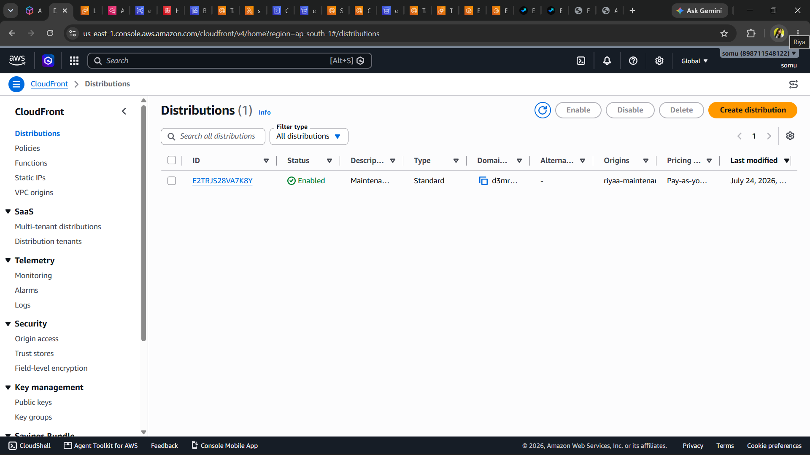
</p>

<p align="center">
<b>Amazon CloudFront Distribution</b>
</p>

---


<p align="center">
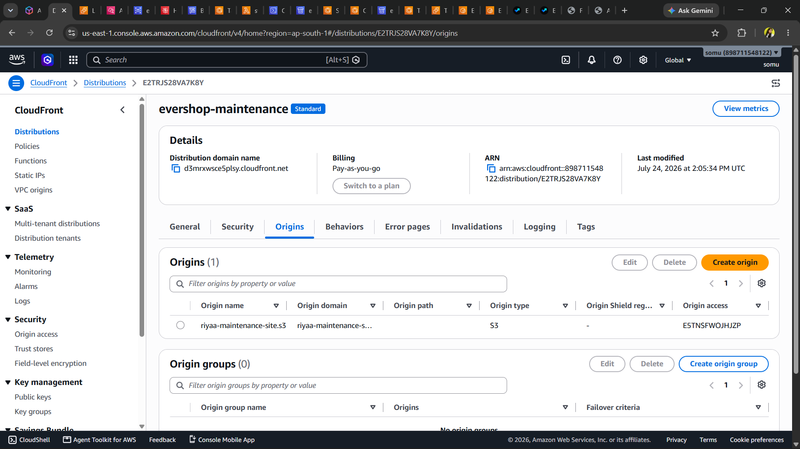
</p>

<p align="center">
<b>CloudFront Origin Configuration</b>
</p>

---

📘 **Detailed Documentation**

```
docs/task-5/README.md
```

---

# 🗂️ Internship Task 6

# Advanced Amazon S3 Storage

## Objective

Implement secure, reliable, and cost-optimized object storage for EverShop product images using Amazon S3 and CloudFront.

The storage solution focuses on secure access, encryption, lifecycle management, and inventory reporting.

---

## AWS Services Used

- Amazon S3
- Amazon CloudFront
- Origin Access Control (OAC)
- Amazon S3 Lifecycle
- Amazon S3 Inventory
- AWS IAM

---

## Storage Architecture

```text
            Product Images

                  │

                  ▼

      Amazon S3 Private Bucket

                  │

                  ▼

       Server Side Encryption

                  │

                  ▼

     Origin Access Control (OAC)

                  │

                  ▼

        Amazon CloudFront CDN

                  │

                  ▼

              End Users
```

---

## Features

- Private Amazon S3 Bucket
- Block Public Access
- Bucket Owner Enforced
- Server Side Encryption
- Origin Access Control
- CloudFront Integration
- Lifecycle Policies
- Intelligent Tiering
- Glacier Transition
- Amazon S3 Inventory

---

## Working

### Product Image Upload

Product images are stored securely inside the private Amazon S3 bucket.

↓

### Secure Storage

All uploaded objects are automatically encrypted using Server-Side Encryption.

↓

### Lifecycle Management

Lifecycle policies automatically move older objects to lower-cost storage classes such as Intelligent-Tiering and Glacier.

↓

### CloudFront Integration

CloudFront securely retrieves images from Amazon S3 using Origin Access Control.

↓

### User Access

Users access images through CloudFront over HTTPS without direct access to the S3 bucket.

---

## Security Features

- Private Bucket
- Block Public Access
- Bucket Owner Enforced
- Server Side Encryption
- Origin Access Control
- HTTPS Delivery

---

## Cost Optimization

- Intelligent Tiering
- Glacier Transition
- Automated Lifecycle Rules
- Reduced Storage Cost

---

## Storage Monitoring

Amazon S3 Inventory generates periodic reports containing information about stored objects, helping with inventory tracking and storage auditing.

---

<p align="center">
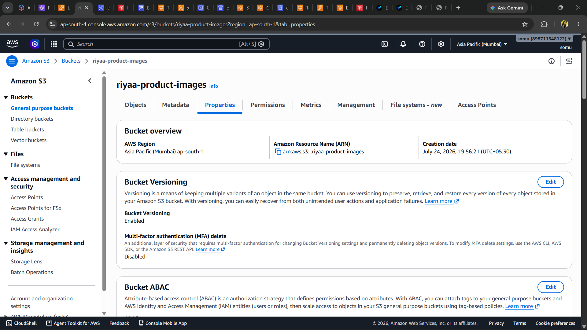
</p>

<p align="center">
<b>Amazon S3 Bucket</b>
</p>


---

<p align="center">
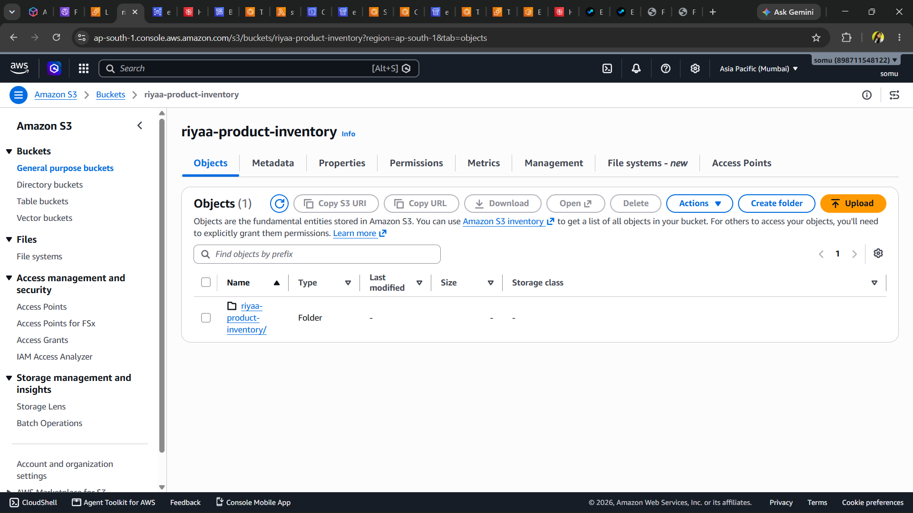
</p>

<p align="center">
<b>Amazon S3 Inventory</b>
</p>

---

<p align="center">
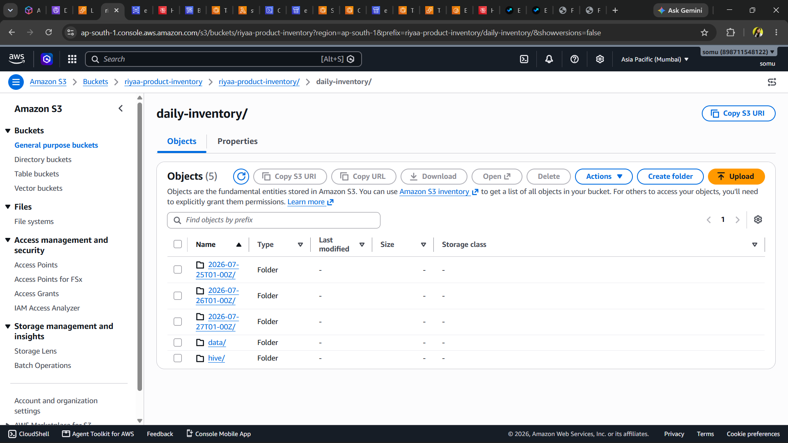
</p>

<p align="center">
<b>EverShop Product Images Served via CloudFront</b>
</p>

---

## AWS Free Tier Considerations

This project was implemented using the AWS Free Tier.

The following enterprise features from the internship description were **not implemented**:

- AWS Lambda@Edge
- AWS WAF
- S3 Object Lambda
- Lambda + ClamAV Malware Scanning

Instead, secure and efficient content delivery was achieved using:

- Amazon CloudFront
- Origin Access Control (OAC)
- Private Amazon S3 Bucket
- Server-Side Encryption
- Lifecycle Policies
- Amazon S3 Inventory

---

## Benefits Achieved

- Secure image storage
- Private object access
- Global image delivery
- Optimized storage costs
- Improved application performance
- Automated storage management

---

📘 **Detailed Documentation**

```
docs/task-6/README.md
```

---

# 📌 Project Progress

| Task | Status |
|------|--------|
| ✅ Task 1 – Route 53 & ACM | Completed |
| ✅ Task 2 – Amazon RDS | Completed |
| ✅ Task 3 – Auto Scaling | Completed |
| ✅ Task 4 – ECS, ECR & CI/CD | Completed |
| ✅ Task 5 – CloudFront | Completed |
| ✅ Task 6 – Advanced S3 Storage | Completed |

---

➡️ Continue to **Part 5** for:

- 🔒 Security Summary
- 💰 Cost Optimization
- 📊 Monitoring & Logging
- 📸 Complete Screenshot Gallery
- 🎯 Project Outcomes
- 🚀 Future Enhancements
- 👩‍💻 Author
- 📄 License

# 🔐 Security Implementation

Security was considered throughout the deployment to protect application resources, user data, and infrastructure.

## Security Features

| Feature | Status |
|----------|--------|
| HTTPS with AWS Certificate Manager | ✅ |
| Private Amazon S3 Bucket | ✅ |
| Block Public Access | ✅ |
| Bucket Owner Enforced | ✅ |
| Origin Access Control (OAC) | ✅ |
| Server-Side Encryption | ✅ |
| IAM Roles & Policies | ✅ |
| Security Groups | ✅ |
| VPC Isolation | ✅ |

---

# 💰 Cost Optimization

The project was implemented using the **AWS Free Tier** wherever possible.

Cost optimization techniques include:

- Amazon S3 Intelligent-Tiering
- Amazon S3 Lifecycle Policies
- Glacier Transition
- CloudFront Edge Caching
- Private S3 Bucket
- Docker Containerization
- ECS Service Management
- Auto Scaling
- Managed Amazon RDS

---

# 📊 Monitoring & Logging

The infrastructure can be monitored using AWS monitoring services.

## Monitoring Components

- Amazon CloudWatch
- ECS Service Health
- EC2 Instance Monitoring
- Auto Scaling Activity
- Application Load Balancer Health Checks
- CloudFront Metrics
- Amazon RDS Monitoring
- Amazon S3 Inventory Reports

---

# 📸 Project Gallery

## Application

<p align="center">

</p>

---

## AWS Architecture

<p align="center">

</p>

---

## Route 53

<p align="center">
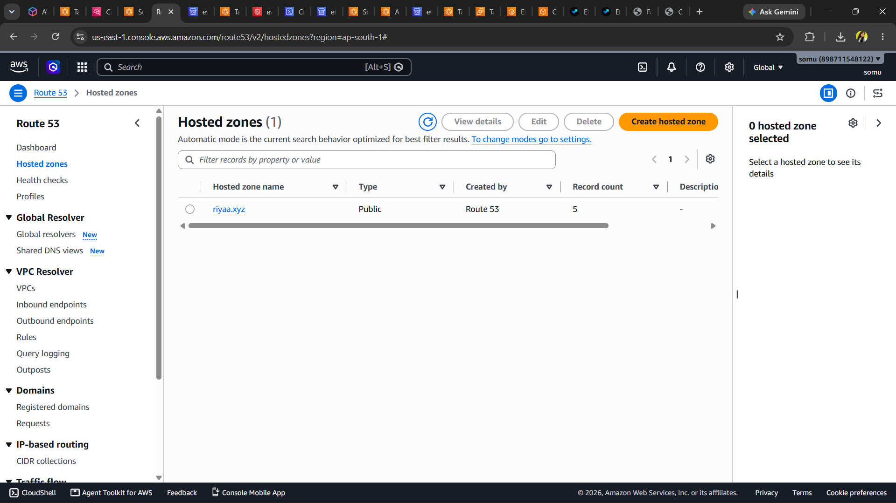
</p>

---

## ACM Certificate

<p align="center">
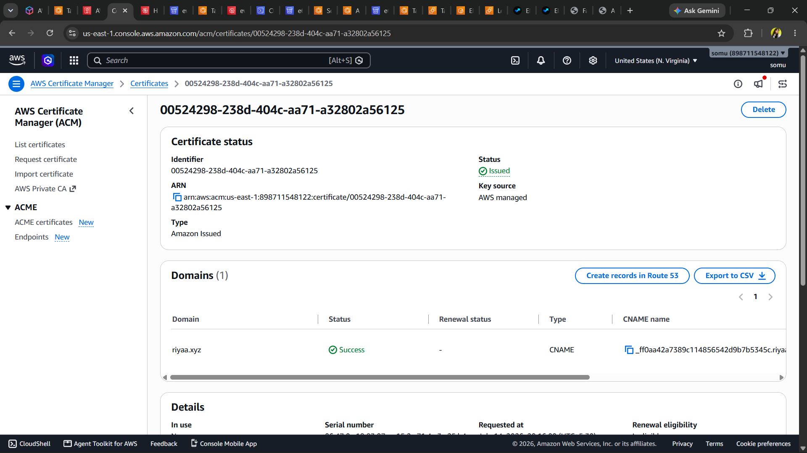
</p>

---

## Amazon RDS

<p align="center">
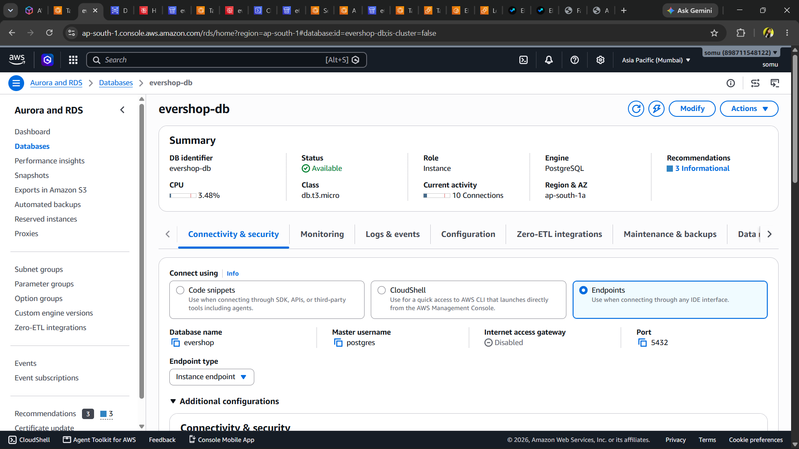
</p>

---

## Auto Scaling Group

<p align="center">

</p>

---

## Amazon ECS Cluster

<p align="center">

</p>

---

## Amazon ECR

<p align="center">

</p>

---

## AWS CodePipeline

<p align="center">

</p>

---

## Amazon CloudFront

<p align="center">

</p>

---

## Amazon S3

<p align="center">

</p>

---

# 📊 AWS Services Used

| Category | Services |
|-----------|----------|
| Compute | Amazon EC2, Amazon ECS |
| Database | Amazon RDS PostgreSQL |
| Networking | Route 53, ALB, CloudFront |
| Storage | Amazon S3 |
| Security | IAM, ACM, OAC |
| DevOps | Docker, Amazon ECR, CodePipeline, CodeBuild |
| Monitoring | Amazon CloudWatch |
| Cost Optimization | Lifecycle Policies, Intelligent-Tiering |

---

# 🏆 Project Achievements

Successfully implemented:

- Production-ready AWS deployment
- Docker containerization
- Amazon ECS deployment
- Amazon ECR image repository
- Automated CI/CD pipeline
- Blue/Green deployment
- Amazon RDS PostgreSQL
- Auto Scaling infrastructure
- CloudFront CDN
- Secure S3 storage
- HTTPS with ACM
- Route 53 custom domain
- Storage lifecycle optimization

---

# 📚 Key Learnings

During this project I gained hands-on experience with:

- AWS Cloud Architecture
- Docker Containerization
- Amazon ECS
- Amazon ECR
- Application Load Balancer
- Route 53 DNS Management
- Amazon CloudFront
- Amazon S3 Storage
- Amazon RDS PostgreSQL
- AWS CodePipeline
- AWS CodeBuild
- Auto Scaling
- Infrastructure Security
- Cloud Deployment Best Practices

---

# 🚀 Future Enhancements

Potential improvements for a production environment include:

- AWS WAF
- Lambda@Edge
- S3 Object Lambda
- Pre-Signed URLs
- Malware Scanning using Lambda + ClamAV
- AWS Secrets Manager
- Amazon ElastiCache (Redis)
- Multi-AZ ECS Deployment
- AWS X-Ray
- AWS Config
- Disaster Recovery Automation

---

# 📌 Internship Tasks Completed

| Task | Description | Status |
|------|-------------|--------|
| Task 1 | Route 53, ACM & HTTPS | ✅ |
| Task 2 | Amazon RDS Deployment | ✅ |
| Task 3 | Auto Scaling | ✅ |
| Task 4 | Amazon ECS & ECR Deployment | ✅ |
| Task 5 | CloudFront Distribution | ✅ |
| Task 6 | Advanced Amazon S3 Storage | ✅ |

---

# 👩‍💻 Author

**Riya**

B.Tech Computer Science Engineering

Cloud & DevOps Enthusiast

GitHub:

```
https://github.com/Riya-te
```

LinkedIn:

```
https://www.linkedin.com/in/Riya kumari/
```

---

# 🙏 Acknowledgements

- AWS Cloud Services
- EverShop Open Source Project
- AWS Documentation
- Docker Documentation
- Amazon ECS Documentation

---

# ⭐ Support

If you found this project helpful, consider giving it a ⭐ on GitHub.

---

# 📄 License

This project is licensed under the **MIT License**.

See the `LICENSE` file for more information.

---

<div align="center">

## 🚀 Thank You for Visiting!

**AWS EverShop Cloud Deployment Platform**

Built with ❤️ using AWS Cloud & DevOps Services.

</div>