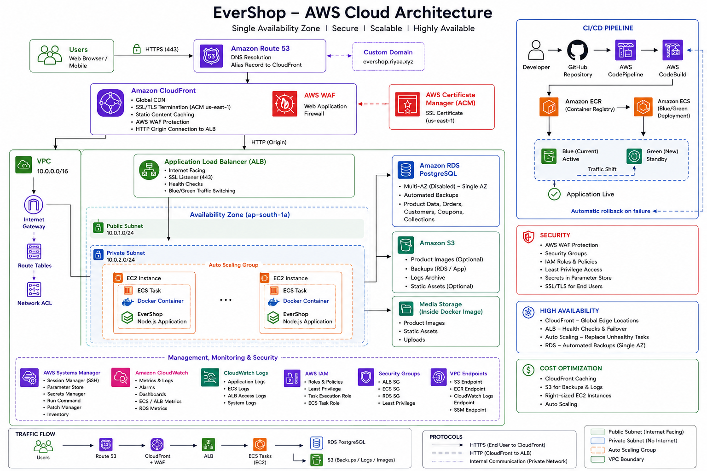

# Task 6 - Advanced Amazon S3 Storage for Product Images

## Objective

Implement a secure and cost-optimized storage solution for EverShop product images using Amazon S3. Configure secure access with CloudFront and Origin Access Control (OAC), enable encryption, optimize storage costs using lifecycle policies, and monitor stored objects with Amazon S3 Inventory.

---

# Architecture



---

# AWS Services Used

| Service | Purpose |
|----------|----------|
| Amazon S3 | Store product images |
| Amazon CloudFront | Deliver images globally with low latency |
| Origin Access Control (OAC) | Secure CloudFront access to the S3 bucket |
| AWS IAM | Manage permissions |
| Amazon S3 Lifecycle | Automatically optimize storage costs |
| Amazon S3 Inventory | Generate object inventory reports |

---

# Implementation

## 1. Private Amazon S3 Bucket

Created a private Amazon S3 bucket to securely store all product images.

### Features

- Private bucket
- Block Public Access enabled
- Bucket Owner Enforced access
- Secure object storage

Only authorized AWS services can access objects stored in the bucket.

---

## 2. Bucket Owner Enforced Access

Configured Object Ownership to **Bucket owner enforced**.

### Benefits

- Access Control Lists (ACLs) disabled
- Bucket owner owns all uploaded objects
- Simplified permission management
- Improved security

---

## 3. Server-Side Encryption

Enabled default server-side encryption for all uploaded objects.

### Features

- Encryption at rest
- Automatic encryption for new uploads
- Secure storage of product images

---

## 4. CloudFront Integration

Integrated Amazon CloudFront with the private S3 bucket using Origin Access Control (OAC).

### Benefits

- Global content delivery
- Reduced latency
- HTTPS support
- Secure image delivery
- Cached content at edge locations

Images are served through CloudFront instead of directly accessing Amazon S3.

---

## 5. Origin Access Control (OAC)

Configured Origin Access Control to securely connect CloudFront with the private S3 bucket.

### Benefits

- Prevents direct public access
- Only CloudFront can retrieve bucket objects
- Improved security over public bucket access

---

## 6. Lifecycle Management

Configured lifecycle rules to optimize storage costs.

### Storage Optimization

- Standard Storage
- Intelligent-Tiering
- Glacier Transition

Older objects are automatically transitioned to lower-cost storage classes based on lifecycle policies.

---

## 7. Amazon S3 Inventory

Enabled Amazon S3 Inventory to generate reports of bucket contents.

### Benefits

- Daily inventory reports
- Object auditing
- Storage visibility
- Eases inventory management

---

# Storage Workflow

```text
Product Images

        │
        ▼

Amazon S3 (Private Bucket)

        │
        ▼

Server-Side Encryption

        │
        ▼

Origin Access Control (OAC)

        │
        ▼

Amazon CloudFront

        │
        ▼

End Users
```

---

# Security Features

- Private Amazon S3 Bucket
- Block Public Access
- Bucket Owner Enforced
- Server-Side Encryption
- Origin Access Control (OAC)
- HTTPS Delivery through CloudFront

---

# Cost Optimization Features

- Intelligent-Tiering
- Glacier Lifecycle Transition
- Automated Lifecycle Policies
- Amazon S3 Inventory

---

# AWS Free Tier Considerations

This project was implemented using the AWS Free Tier.

The following enterprise features mentioned in the internship requirements were **not implemented**:

- Pre-Signed URLs
- S3 Object Lambda
- Malware Scanning using AWS Lambda + ClamAV

Instead, secure storage and content delivery were achieved using:

- Private Amazon S3 Bucket
- Amazon CloudFront
- Origin Access Control (OAC)
- Server-Side Encryption
- Lifecycle Policies
- Amazon S3 Inventory

---

# Outcome

Successfully implemented a secure and optimized storage architecture for EverShop product images.

The implementation provides:

- Secure image storage
- Private bucket access
- Encrypted object storage
- CloudFront image delivery
- Cost-optimized storage lifecycle
- Automated inventory reporting
- High-performance global content delivery